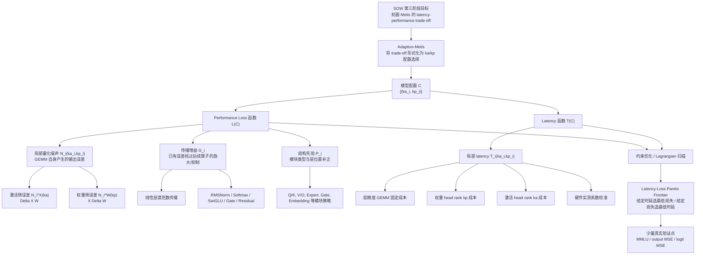
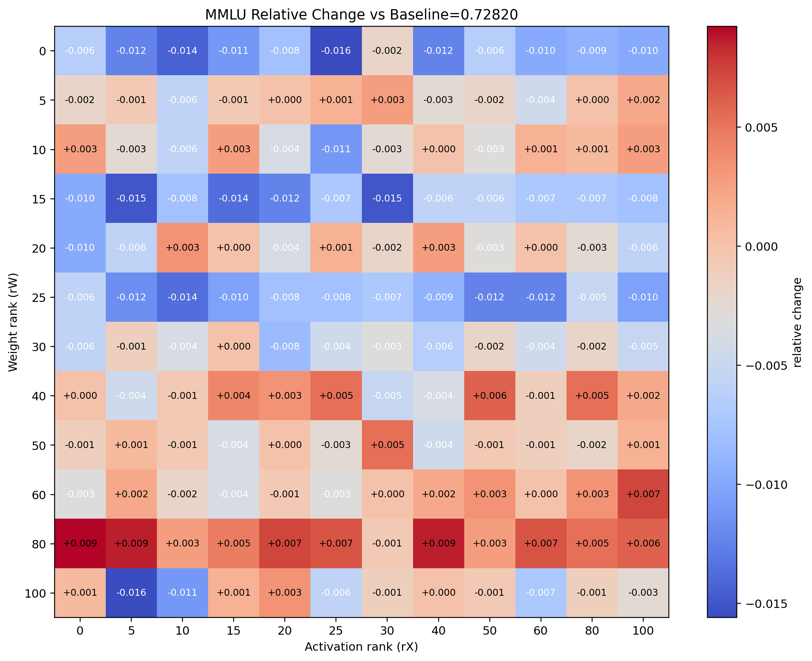
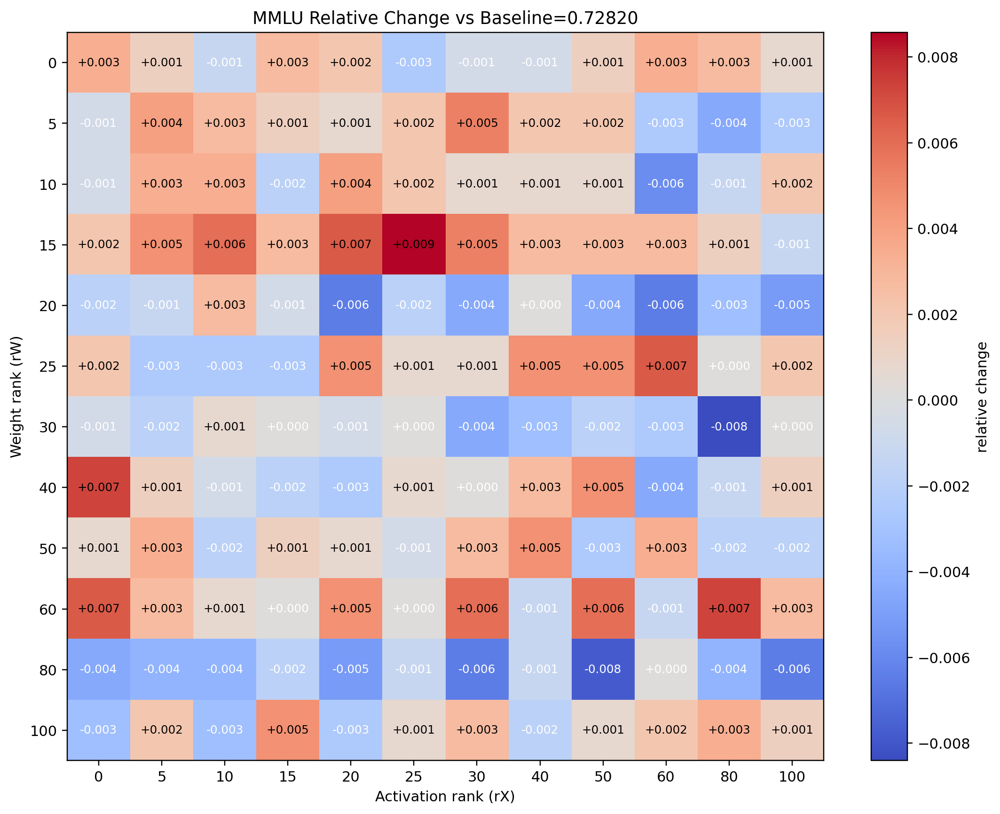
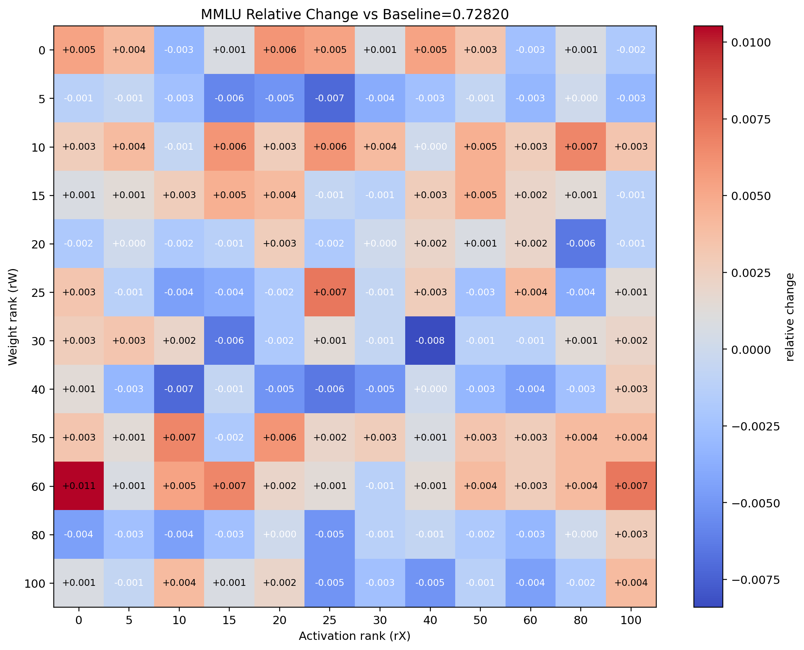

# Adaptive-Metis 阶段性技术方案

## 0. 方法结构总览



## 1. 阶段目标与问题定义

SOW 第三阶段的核心目标是刻画 Metis 方案的 **latency-performance trade-off**：在不同推理时延预算下评估可达到的模型性能，并在给定性能要求下寻找尽可能低时延的部署配置。

本阶段将该目标进一步形式化为 Metis 推理中的 rank allocation 问题。具体而言，Metis 对权重矩阵和激活矩阵进行谱空间分解，将主谱方向以高精度保留，将残差谱空间交给低精度 GEMM 计算。因此，权重侧 rank `kp` 与激活侧 rank `ka` 成为控制精度与时延的核心变量：

- `kp` 控制权重矩阵保留多少高精度主谱方向；
- `ka` 控制激活矩阵保留多少高精度主谱方向；
- 更大的 `ka/kp` 通常降低 residual 量化风险，但会增加在线分解、低秩分支和混合精度 GEMM 的计算开销；
- 更小的 `ka/kp` 降低 latency，但会把更多信息留在低精度 residual 中，从而增加精度损失。

由于不同层、不同模块、不同矩阵的谱分布与量化敏感性不同，统一的全模型 `ka/kp` 难以同时兼顾精度和时延。Adaptive-Metis 的目标是在给定模型、校准数据和目标低精度格式后，自动估计不同位置的量化风险与时延代价，为各个 GEMM 模块分配合适的 `ka/kp`，并生成可供部署选择的 latency-loss Pareto 曲线。

对于一个模型配置：

```math
C = \{(k_{a,i}, k_{p,i})\}_{i=1}^{N}
```

其中 `i` 表示第 `i` 个可量化 GEMM 模块。Adaptive-Metis 构造两个函数：

```math
L(C)
```

和：

```math
T(C)
```

其中 `L(C)` 表示配置 `C` 对应的预测损失，`T(C)` 表示配置 `C` 对应的推理时延。由此，SOW 中的 latency-performance trade-off 可以写成两类等价优化问题：

```math
\min_C L(C) \quad s.t. \quad T(C) \le B
```

或：

```math
\min_C T(C) \quad s.t. \quad L(C) \le \epsilon
```

本阶段最终输出不是单个固定配置，而是一条 latency-loss Pareto frontier。客户可以根据业务对时延或精度的要求，在曲线上选择相应运行点；对于 accuracy loss 小于 1% 的目标，则在曲线上标出满足该约束的可行配置及其 latency。

同一套建模流程可应用于 HIF4、NVFP4 等不同低精度数据格式，并分别得到对应格式下的 Pareto 曲线。

### 1.1 全局 loss 与 latency 函数定义

Adaptive-Metis 将全局预测损失建模为三个因素的乘积后求和：

```math
L(C)
=
\sum_i
N_i(k_{a,i}, k_{p,i})
G_i
P_i
```

其中：

- `N_i(k_a,k_p)`：第 `i` 个 GEMM 模块自身产生的局部量化噪声；
- `G_i`：该 GEMM 输出扰动传播到模型末端时的误差传播增益；
- `P_i`：模块结构先验，用于修正纯数值误差与实际任务敏感性之间的差异。

Latency 函数局部可加：

```math
T(C)
=
\sum_i
T_i(k_{a,i}, k_{p,i})
```

因此，本阶段方案由四个核心环节组成：

1. 建立每个 GEMM 的局部量化噪声函数 `N_i(ka,kp)`；
2. 建立每个 GEMM 的误差传播增益 `G_i`；
3. 引入模块结构先验 `P_i`；
4. 建立每个 GEMM 的 latency 函数 `T_i(ka,kp)`，并基于 `L(C)` 与 `T(C)` 生成 Pareto 曲线。

该建模方式保持了 Metis 的谱空间理论基础：`ka/kp` 表示保留的主谱方向数量，局部噪声来自 residual 谱空间在目标低精度格式下的量化风险，传播增益刻画该误差在后续模型结构中的放大能力。

## 2. Performance Loss 函数建模

Performance loss 函数用于预测给定 `ka/kp` 配置下的模型质量损失。本阶段将其拆解为三个部分：GEMM 局部量化噪声 `N_i`、误差传播增益 `G_i` 和模块结构先验 `P_i`。本章按这三个部分展开。

### 2.1 GEMM 局部量化噪声 `N_i`

对于一个线性模块：

```math
Y = XW
```

Metis 将激活和权重分解为高精度低秩 head 与低精度 residual：

```math
X = X_{\text{head}}(k_a) + X_{\text{res}}(k_a)
```

```math
W = W_{\text{head}}(k_p) + W_{\text{res}}(k_p)
```

低精度计算作用在 residual 上：

```math
\hat X
=
X_{\text{head}}(k_a)
+
Q_f(X_{\text{res}}(k_a))
```

```math
\hat W
=
W_{\text{head}}(k_p)
+
Q_f(W_{\text{res}}(k_p))
```

定义量化误差：

```math
\Delta X(k_a)
=
Q_f(X_{\text{res}}(k_a))
-
X_{\text{res}}(k_a)
```

```math
\Delta W(k_p)
=
Q_f(W_{\text{res}}(k_p))
-
W_{\text{res}}(k_p)
```

则 GEMM 输出误差为：

```math
\Delta Y
=
\hat X \hat W - XW
```

展开得到：

```math
\Delta Y
=
X\Delta W
+
\Delta XW
+
\Delta X\Delta W
```

其中：

- `XΔW` 表示权重量化误差导致的输出扰动；
- `ΔXW` 表示激活量化误差导致的输出扰动；
- `ΔXΔW` 表示二阶交叉项。

在主建模中保留一阶项：

```math
\Delta Y
\approx
X\Delta W + \Delta XW
```

这样可将 `ka` 和 `kp` 对输出误差的影响近似拆开，避免对每个 GEMM 枚举完整二维组合。局部噪声函数写为：

```math
N_i(k_a,k_p)
=
\alpha_x N_i^X(k_a)
+
\alpha_w N_i^W(k_p)
```

其中激活侧噪声定义为：

```math
N_i^X(k_a)
=
\frac{
\mathbb{E}_{X \sim D_{\text{calib}}}
\|\Delta X_i(k_a)W_i\|_F^2
}{
\mathbb{E}_{X \sim D_{\text{calib}}}
\|X_iW_i\|_F^2
}
```

权重侧噪声定义为：

```math
N_i^W(k_p)
=
\frac{
\mathbb{E}_{X \sim D_{\text{calib}}}
\|X_i\Delta W_i(k_p)\|_F^2
}{
\mathbb{E}_{X \sim D_{\text{calib}}}
\|X_iW_i\|_F^2
}
```

在需要进一步降低 profiling 成本时，可使用谱范数上界：

```math
\|X\Delta W\|_F
\le
\|X\|_F \|\Delta W\|_2
```

```math
\|\Delta XW\|_F
\le
\|\Delta X\|_F \|W\|_2
```

从而得到近似：

```math
N_i^W(k_p)
\propto
\frac{\|\Delta W_i(k_p)\|_2^2}{\|W_i\|_2^2}
```

```math
N_i^X(k_a)
\propto
\frac{
\mathbb{E}\|\Delta X_i(k_a)\|_F^2
}{
\mathbb{E}\|X_i\|_F^2
}
```

该部分体现了 Adaptive-Metis 的谱空间建模思路：rank 选择不是直接在任务指标上搜索，而是在不同 `ka/kp` 下评估 residual 谱空间在目标低精度格式中的量化风险。

### 2.2 离线 Profiling 内容

#### 2.2.1 权重侧 profiling

对每个 GEMM 权重矩阵 `W_i` 执行 SVD 或 randomized SVD，得到：

- 最大奇异值；
- 谱能量累积分布；
- `rank80 / rank90 / rank95`；
- residual energy：

```math
1 - E_W(k_p)
```

其中：

```math
E_W(k)
=
\frac{
\sum_{j \le k}\sigma_j(W)^2
}{
\|W\|_F^2
}
```

对不同 `kp` 构造：

```math
W_{\text{res}}(k_p)
=
W - W_{\text{head}}(k_p)
```

并在目标低精度格式下统计：

- residual quantization error；
- effective zero rate；
- saturation rate；
- block scale variance；
- block max / rms；
- outlier ratio。

上述指标用于估计 `N_i^W(kp)`，同时解释不同模块为什么需要不同 `kp`。

#### 2.2.2 激活侧 profiling

使用 calibration set 做一次前向采样，记录每个 GEMM 输入激活 `X_i` 的谱性质：

- 最大奇异值；
- 谱能量累积分布；
- `rank80 / rank90 / rank95`；
- 不同 batch 之间 top-k 子空间稳定性；
- activation norm / RMS 分布。

对不同 `ka` 构造：

```math
X_{\text{res}}(k_a)
=
X - X_{\text{head}}(k_a)
```

并在目标低精度格式下统计：

- residual quantization error；
- effective zero rate；
- saturation rate；
- block scale variance；
- block max / rms；
- outlier ratio。

这些指标用于估计 `N_i^X(ka)`。Calibration set 在这里用于估计真实输入分布下的激活谱结构与 residual 量化风险，而不是用于直接搜索下游任务 accuracy。

### 2.3 误差传播增益 `G_i`

局部量化噪声只描述某个 GEMM 自身产生的输出扰动。该扰动会继续经过后续线性层、RMSNorm、Softmax、SwiGLU、Residual Add、MoE Gate 等结构，最终影响模型输出。因此，需要为每个 GEMM 估计传播增益：

```math
G_i
```

对于线性层：

```math
y = xW
```

输入扰动满足：

```math
\delta y = \delta xW
```

最坏情况放大系数由谱范数给出：

```math
\|\delta y\|_2
\le
\|\delta x\|_2
\|W\|_2
```

因此线性层传播系数可写为：

```math
c_{\text{linear}}
=
\|W\|_2^2
```

对于非 GEMM 算子，其本身通常保持高精度计算，不产生新的低精度量化噪声，但会影响已有扰动的传播。

#### 2.3.1 RMSNorm

RMSNorm 定义为：

```math
y = \gamma \frac{x}{r}
```

```math
r = \sqrt{\frac{1}{d}\|x\|_2^2+\epsilon}
```

其 Jacobian 谱范数可由以下上界估计：

```math
\|J_{\text{RMSNorm}}(x)\|_2
\le
\frac{\|\gamma\|_\infty}{r}
```

因此可离线估计：

```math
c_{\text{rms},l}
=
\mathbb{E}_{x \sim D_{\text{calib}}}
\frac{\|\gamma_l\|_\infty^2}{r_l(x)^2}
```

#### 2.3.2 Softmax

Softmax 高精度计算，但会决定 attention logits 误差如何传递到 attention probability。

```math
p = \text{softmax}(s)
```

```math
J_{\text{softmax}}(s)
=
\text{diag}(p)-pp^T
```

其通用上界为：

```math
\|J_{\text{softmax}}\|_2 \le 0.5
```

实际传播强度与 attention 分布有关，因此 profiling 中记录 attention entropy、top1-top2 margin 以及 softmax Jacobian norm 的近似值，用于估计 Q/K 路径的传播增益。

#### 2.3.3 SwiGLU

SwiGLU 通常写为：

```math
y = \text{SiLU}(a) \odot b
```

一阶扰动为：

```math
\delta y
=
b \odot \text{SiLU}'(a) \odot \delta a
+
\text{SiLU}(a) \odot \delta b
```

其中：

```math
\text{SiLU}'(x)
=
\sigma(x)+x\sigma(x)(1-\sigma(x))
```

对应传播系数可由 calibration activation 离线估计：

```math
c_{\text{swiglu},l}
=
\mathbb{E}
\left[
\frac{
\|b \odot \text{SiLU}'(a)\|_F^2
+
\|\text{SiLU}(a)\|_F^2
}{
\|y\|_F^2
}
\right]
```

#### 2.3.4 MoE Gate

MoE Gate 固定高精度处理，不作为低精度 GEMM 目标。Gate 的风险主要来自前序扰动可能改变 expert assignment。其传播风险可写为：

```math
c_{\text{gate}}
=
c_{\text{continuous}}
+
P_{\text{flip}}c_{\text{switch}}
```

其中：

- `c_continuous` 表示 routing 不变时 gate 权重变化带来的连续误差；
- `P_flip` 表示 top-k expert set 发生改变的概率；
- `c_switch` 表示 expert 切换后的输出差异。

离线 profiling 中记录 gate margin：

```math
m = g_{\text{top-k}} - g_{\text{top-(k+1)}}
```

margin 越小，routing 越容易受前序扰动影响。

#### 2.3.5 Residual Add

Residual Add 高精度计算，不产生新量化噪声。对于：

```math
y = x + F(x)
```

扰动传播为：

```math
\delta y
=
\delta x + J_F(x)\delta x
```

传播系数可写为：

```math
c_{\text{residual}}
\approx
(1+c_F^{1/2})^2
```

也可通过 calibration set 注入小扰动估计：

```math
c_{\text{residual}}
=
\mathbb{E}
\frac{
\|\delta y\|_F^2
}{
\|\delta x\|_F^2
}
```

#### 2.3.6 GEMM 到模型末端的传播增益

对于第 `i` 个 GEMM 产生的局部扰动，后续算子的传播系数为：

```math
c_{i+1}, c_{i+2}, \ldots, c_{\text{end}}
```

整体传播增益近似为：

```math
G_i
\approx
\prod_{j>i}
c_j
```

实际实现中在 log-domain 中累计传播系数：

```math
\log G_i
=
\sum_{j>i}
\log c_j
```

并结合 block-level 传播系数与上下界裁剪，避免极端系数主导全部优化。

### 2.4 模块结构先验 `P_i`

纯数值 MSE 或谱范数无法完全表达 Transformer 结构中的任务相关差异，因此 Adaptive-Metis 引入结构先验：

```math
P_i
=
P_{\text{module}}(m_i)
P_{\text{depth}}(l_i)
```

结构先验用于把数值误差 proxy 修正为更符合模型结构的风险估计。例如：

- Q/K 的误差会经过 attention softmax，绝对 MSE 不一定直接等价于最终任务损失；
- V/O 和 MLP 输出直接进入 residual stream，对后续 hidden state 的影响更直接；
- MoE expert 的量化损失通常比 gate 权重量化更值得关注；
- MoE gate 矩阵较小且 routing 翻转风险高，采用固定高精度策略；
- embedding 和 lm head 不并入普通 GEMM 的低精度 rank 分配流程。

当前建模中采用以下模块策略：

- attention `q/k` 使用同一组 `ka/kp`；
- attention `v/o` 使用同一组 `ka/kp`；
- MoE gate 矩阵不量化；
- expert 中 `up/gate` 使用同一组 `ka/kp`；
- expert 中 `down` 使用同一组 `ka/kp`；
- embedding 和 lm head 不量化，固定高精度或单独处理。

该策略可显著减少优化变量数量，同时保持与 Transformer 模块语义一致。

## 3. Latency 函数建模

与 loss 不同，latency 是局部可加的。一个 GEMM 的 latency 由其自身计算形态决定，不受前后层误差传播影响。

全局 latency 写为：

```math
T(C)
=
\sum_i
T_i(k_{a,i}, k_{p,i})
```

每个模块的 latency 由两部分得到：

1. **理论 cost model**：根据 low-bit GEMM、high-rank 分支、数据搬运和 rank 大小估计计算量；
2. **硬件实测系数**：在目标硬件上测量代表性 kernel，用于校准理论模型。

一个基本形式为：

```math
T_i(k_a,k_p)
=
T_{0,i}
+
a_i k_a
+
b_i k_p
```

如果硬件 kernel 对 tile size、rank 对齐、batch size 或 sequence length 有明显分段行为，则使用分段线性函数：

```math
T_i(k_a,k_p)
=
\text{PiecewiseLinear}_i(k_a,k_p)
```

该 latency 函数可通过局部实测和理论建模获得，并可直接在全模型层面求和。

## 4. 函数简化与 Pareto 曲线生成

### 4.1 候选 rank 离散化

Adaptive-Metis 使用硬件友好的候选 rank 集合，例如：

```math
K = \{0, 8, 16, 32, 64, 128\}
```

或根据已有实验设置为：

```math
K = \{0, 5, 10, 15, 30, 60, 100\}
```

该处理避免连续优化，并保证 rank 与实际 kernel 实现对齐。

### 4.2 局部 Pareto 过滤

对于每个模块或模块组，候选配置为：

```math
c_i=(k_{a,i},k_{p,i})
```

计算：

```math
(L_i(c_i), T_i(c_i))
```

如果存在另一个候选 `c'`，满足：

```math
L_i(c') \le L_i(c)
```

且：

```math
T_i(c') \le T_i(c)
```

则 `c` 为非 Pareto 点，在后续优化中移除。

对于采样噪声导致的非单调预测 loss，使用单调化修正：

```math
L(k+\Delta k)
\leftarrow
\min(L(k+\Delta k), L(k))
```

### 4.3 高风险模块优先优化

首先用默认低 rank 计算每个模块或模块组的风险：

```math
R_i
=
N_iG_iP_i
```

然后将 rank 分配优先集中在高风险模块上，使有限 latency budget 用在最有效的位置。

### 4.4 Lagrangian 扫描

Adaptive-Metis 使用 Lagrangian 扫描生成完整 Pareto 曲线：

```math
C^*(\lambda)
=
\arg\min_C
\left[
L(C)+\lambda T(C)
\right]
```

由于：

```math
L(C)
=
\sum_i L_i(c_i)
```

```math
T(C)
=
\sum_i T_i(c_i)
```

该问题可分解为局部选择：

```math
c_i^*(\lambda)
=
\arg\min_{c_i}
\left[
L_i(c_i)+\lambda T_i(c_i)
\right]
```

扫描不同 `lambda`，得到：

```math
\{(T(C^*(\lambda)), L(C^*(\lambda)))\}
```

即 predicted latency-loss Pareto frontier。

当 `lambda` 较小时，优化更重视 loss，会选择更高 rank、较高 latency 的配置。当 `lambda` 较大时，优化更重视 latency，会选择更低 rank、较高 predicted loss 的配置。

## 5. 当前验证计划

Adaptive-Metis 的主流程不使用 task accuracy 直接搜索 rank，而是构造理论驱动的 predicted loss。真实任务评测用于验证 Pareto 曲线趋势，并标定 predicted loss 与实际性能之间的关系。

本阶段验证内容包括：

1. BF16 baseline；
2. 纯低精度配置，例如 `ka=0,kp=0`；
3. uniform Metis 配置，即所有模块共享固定 `(ka,kp)`；
4. Adaptive-Metis Pareto 曲线上的低 latency 点；
5. Adaptive-Metis Pareto 曲线上的中等 latency 点；
6. Adaptive-Metis Pareto 曲线上满足 accuracy loss 小于 1% 的可行点。

报告指标包括：

- predicted loss vs latency 曲线；
- 真实 validation points；
- task accuracy / MMLU accuracy；
- output MSE 或 logit MSE；
- HIF4 与 NVFP4 的独立结果。

Validation 不参与大规模 rank 搜索，而用于验证 `L(C)` 与真实质量指标之间的一致趋势，并用于拟合全局尺度：

```math
\text{real loss}
\approx
aL(C)+b
```

## 6. 本阶段执行流程

固定模型、校准数据和目标低精度格式后，Adaptive-Metis 执行流程如下。

1. **采集 calibration activations**  
   前向运行代表性 calibration set，记录每个 GEMM 输入激活、attention 分布、RMSNorm 输入 RMS、SwiGLU activation、gate margin 等信息。

2. **分析权重谱特性**  
   对每个 GEMM 权重矩阵做 SVD 或 randomized SVD，得到谱能量分布和不同 `kp` 下的 residual。

3. **分析激活谱特性**  
   对每个 GEMM 输入激活估计谱能量分布和不同 `ka` 下的 residual。

4. **估计局部量化噪声**  
   分别计算 `N_i^X(ka)` 和 `N_i^W(kp)`，组合得到 `N_i(ka,kp)`。

5. **估计传播增益**  
   对 GEMM、RMSNorm、Softmax、SwiGLU、Gate、Residual 等结构估计传播系数，并组合得到每个 GEMM 到模型末端的 `G_i`。

6. **加入结构先验**  
   根据模块类型和层位置设置 `P_i`，修正纯 MSE proxy 与任务敏感性之间的偏差。

7. **构造全局函数**  
   得到：

```math
L(C)
=
\sum_i
N_i(k_{a,i},k_{p,i})G_iP_i
```

和：

```math
T(C)
=
\sum_i
T_i(k_{a,i},k_{p,i})
```

8. **候选压缩与过滤**  
   完成模块分组、candidate ranks 离散化、非 Pareto 点过滤和单调化修正。

9. **生成 Pareto frontier**  
   使用 Lagrangian 扫描得到 predicted latency-loss 曲线。

10. **完成真实点验证**  
    在 Pareto 曲线上选取代表配置，真实评测 MMLU、output MSE 或 logit MSE，并标出满足 accuracy loss 小于 1% 的配置。

## 7. 先期可行性探索：ka/kp Sweep 结果

在 Adaptive-Metis 完整建模与优化流程落地前，我们已经针对不同低精度格式进行了 `ka/kp` sweep 实验。该实验相当于对 rank 配置空间进行穷举式可行性探索，用于观察不同 `ka/kp` 组合下的任务性能边界，并为后续 Pareto 建模提供先验参考。

从工程意义上看，sweep 实验并不是最终交付方式，因为它需要遍历大量 rank 组合，成本较高；但它可以作为最坏情况探索手段，验证在目标数据格式下是否存在可行的 latency-performance trade-off 区域。如果某种格式在 sweep 中已经无法找到可接受性能点，则后续自适应优化的收益空间也会受到限制。

### 7.1 HIFP8 ka/kp sweep



### 7.2 NVFP8 ka/kp sweep



### 7.3 MXFP8 ka/kp sweep



从先期 sweep 结果看，NVFP8 与 HIFP8 在 `ka/kp` 空间中表现出更明确的可优化区域，更适合作为后续 Adaptive-Metis 的交付格式。MXFP8 结果可作为对比组保留，用于说明不同数据格式下 residual 谱空间量化风险存在明显差异。

需要说明的是，上一次双周会已经明确后续交付围绕 NVFP4 与 HIF4 展开。因此，本阶段沿用该交付方向，不修改 SOW 范围；当前 FP8 sweep 结果主要作为先期可行性探索和格式选择依据，用于支持后续在 NVFP4 / HIF4 上继续完成 Adaptive-Metis 的 latency-performance Pareto 建模。

Adaptive-Metis 的核心价值在于：不依赖对所有 rank 组合做真实任务搜索，而是通过谱空间 residual 量化风险、误差传播增益和结构先验构建可优化的全局风险函数，从而以较低离线成本生成可供部署选择的 latency-performance Pareto frontier。
