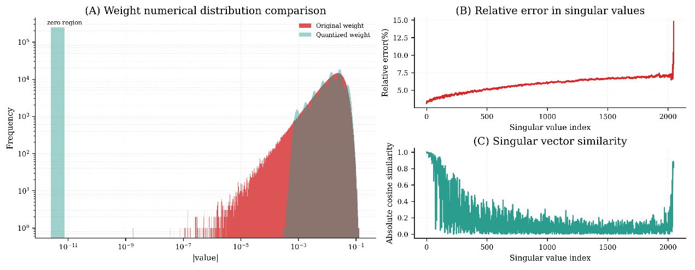
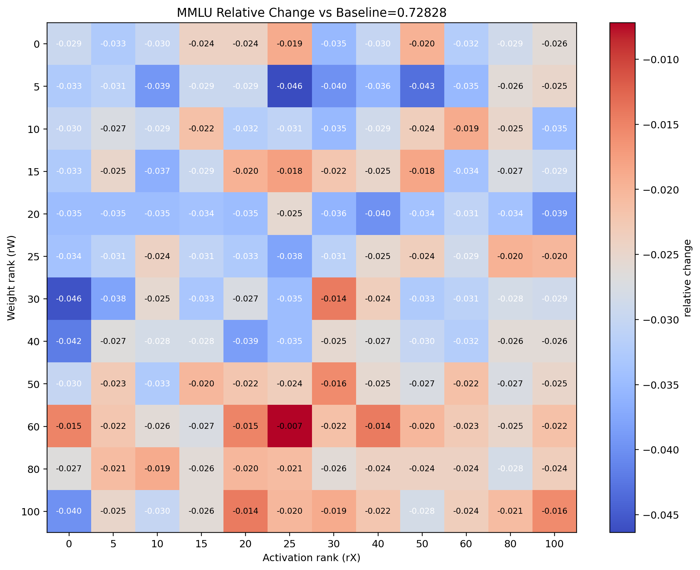
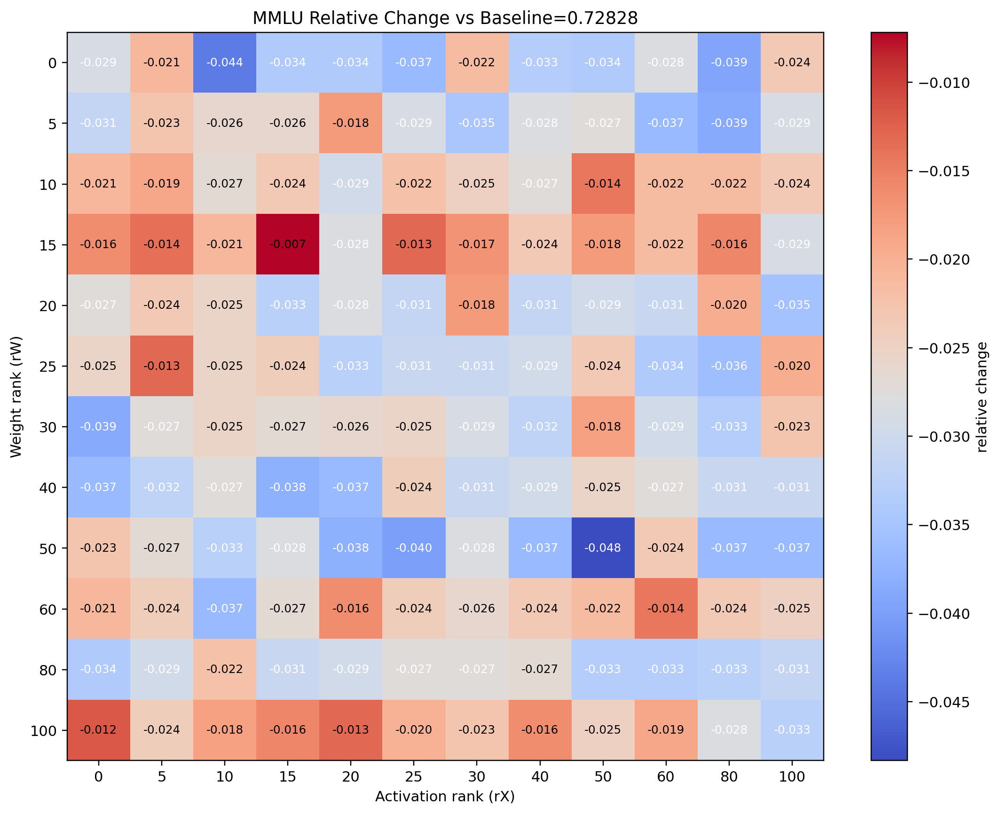
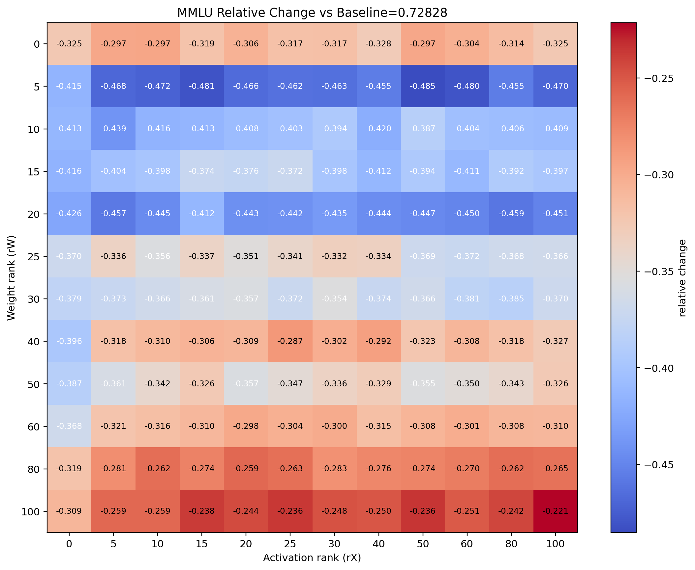

# 面向 LLM 的谱感知量化建模：策略、数据语义与模块敏感性

## 研究背景

低比特量化已成为大规模训练与部署大语言模型（LLMs）的必经步骤。然而，我们的研究发现量化误差并非均匀分布：它会集中在谱空间的长尾方向，并以非平凡的方式与数据语义以及模型算子相互作用。基于我们在第二阶段完成的谱分析，本项目旨在回答如下核心问题：如何设计一种自适应的混合精度量化策略，在满足端到端推理时延约束的同时最大化模型精度？

## 量化误差的谱空间建模

量化误差产生并导致下游任务性能下降的主要原因，是参数矩阵的奇异值分布存在显著的各向异性。具体而言，少量占优奇异值贡献了大部分谱能量，从而使原始参数呈现过宽的数值分布。与此同时，浮点表示存在精度偏置，会在量化过程中将大量小幅度数值裁剪掉，导致与小奇异值对应的奇异方向在谱空间中发生严重的信息损失。

## 参数矩阵的各向异性

对于权重矩阵 $W \in \mathbb{R}^{m \times n}$，我们进行奇异值分解（SVD），得到奇异值 $\{\sigma_i\}_{i=1}^{\min(m,n)}$、左奇异向量 $\{u_i\}_{i=1}^{m} \in \mathbb{R}^m$ 与右奇异向量 $\{v_i\}_{i=1}^{n} \in \mathbb{R}^n$，使得

$$W = \sum_{i=1}^{\min(m,n)} \sigma_i u_i v_i^\top .$$

我们假设奇异值按降序排列，即 $\sigma_1 \ge \sigma_2 \ge \cdots \ge \sigma_r > 0$，其中 $r = \min(m,n)$。如下图所示，多个预训练模型最后一个前馈网络（FFN）模块的奇异值谱呈现高度偏斜的分布：仅有极小比例的奇异值主导了整个谱（分别为 1.9%、2.2%、2.1% 与 2.4%）。该比例在不同模型规模之间相对稳定，表明各向异性特征具有一致性。

以占优奇异值加速增长为特征的各向异性趋势，会显著增大参数矩阵的逐元素方差。令 $\mu$ 表示 $W \in \mathbb{R}^{m \times n}$ 的经验均值，则其方差可写为

$$\mathrm{Var}(W) = \frac{1}{mn} \|W\|_F^2 - \mu^2
= \frac{1}{mn} \sum_{i=1}^{r} \sigma_i^2 - \mu^2 .$$

因此，由占优奇异值驱动的谱能量增长会直接放大 $\mathrm{Var}(W)$。根据 Popoviciu 不等式，有界随机变量 $X$ 的取值范围满足

$$\mathrm{range}(X) \ge 2\sqrt{\mathrm{Var}(X)} .$$

将该不等式应用到 $W$ 的逐元素取值（实践中可认为有界），可得

$$\mathrm{range}(W) \ge 2\sqrt{\mathrm{Var}(W)}
= 2\sqrt{\frac{1}{mn} \sum_i \sigma_i^2 - \mu^2} .$$

该结果表明：由奇异值分布各向异性引起的谱能量增加，会抬高逐元素取值范围的下界，从而在实践中使参数分布更“宽”。

浮点精度偏置与谱域量化损失

为适配低比特精度，量化粒度已经从粗粒度的张量级缩放演进到通道级、再到更细粒度的块级缩放，以尽可能减小重建误差。令 $Q_b$ 表示一个 $b$-bit 量化函数，将全精度或半精度矩阵 $A \in \mathbb{R}^{m \times n}$ 映射为其量化结果 $\bar{A} = Q_b(A)$。由于低精度格式的动态范围受限，块量化方案（例如 FP8 E4M3 与 NVFP4）已逐步成为硬件原生标准。

以 MXFP4 为例，对于长度为 $t=32$ 的块 $B \in \mathbb{R}^{t}$，其缩放因子定义为

$$s = \frac{\max(B)}{2^{b-1}-1}, \quad b=4 .$$

块内每个元素 $b_i \in B$ 的量化形式为

$$Q^{\mathrm{M}}_4(b_i) = \mathrm{round}\!\left(\frac{b_i}{s}\right) \cdot s .$$

该机制天然偏向大幅度数值。由于缩放因子 $s$ 由最大绝对值主导，小数值的量化分辨率 $\Delta = s / 2^{b-1}$ 会变得过于粗糙，导致小幅度元素常被裁剪到 0，形成系统性偏差，而非无偏噪声。如下图所示，参数矩阵中的大量小数值在量化后被裁剪为 0，构成量化损失的主要来源。

进一步的谱分析表明：与大奇异值相比，小奇异值在量化后的相对误差显著更大；同时，与小奇异值对应的奇异方向，其与量化前对应方向的相似度退化更为严重。

## Metis：谱域 FP4 量化

基于上述分析，我们提出一种方法 Metis。对于任意矩阵 $A$——无论是权重矩阵还是激活矩阵——我们将其分解为低秩占优部分（head）与残差部分：

$$A = A_{\text{head}} + A_{\text{res}} = U_k \Sigma_k V_k^\top + R,$$

其中 $k \ll \min(m, n)$（通常取 $k = 1\% \cdot d$），$U_k, \Sigma_k, V_k$ 表示近似 SVD 的 top-$k$ 分量，$R$ 为残差矩阵。由于 $A_{\text{head}}$ 捕获了主要的动态范围，我们默认以高精度（例如 BF16）保留它；而 $A_{\text{res}}$ 的数值分布更紧凑，因此更适合进行 4-bit 量化。

在推理过程中，当对权重矩阵 $W$ 与激活矩阵 $X$ 同时应用 Metis 分解时，原始矩阵乘法 $Y = WX$ 会展开为四项：

$$Y = (W_{\text{head}} + W_{\text{res}})(X_{\text{head}} + X_{\text{res}})
= W_{\text{head}} X_{\text{head}} + W_{\text{head}} X_{\text{res}} + W_{\text{res}} X_{\text{head}} + W_{\text{res}} X_{\text{res}}.$$

需要注意的是，上式中的 $W_{\text{head}}$ 与 $X_{\text{head}}$ 并不会以显式稠密矩阵的形式存储或计算。相反，它们以低秩分解的形式维护：分别为 $U_k^{(W)} S_k^{(W)} V_k^{(W)\top}$ 与 $U_k^{(X)} S_k^{(X)} V_k^{(X)\top}$。与重建的稠密矩阵相比，这种因子化表示在显存占用与计算开销上更高效。为便于记号表达，本文后续仍用 $W_{\text{head}}$ 与 $X_{\text{head}}$ 表示这些低秩因子。上述四项对应的四种乘法为：

1. 高精度 $\times$ 高精度（BF16 GEMM）；
2. 高精度 $\times$ 4-bit（混合精度 GEMM）；
3. 4-bit $\times$ 高精度（混合精度 GEMM）；
4. 4-bit $\times$ 4-bit（FP4 GEMM）。

该分解将大部分量化误差集中到可以由高精度 head 分量补偿的方向上，因此相较于均匀量化能带来更低的整体精度损失。

# Metis 4-bit 推理的时延-性能权衡

## Metis 时延拆解

为了评估 Metis 方法的实际部署价值，必须刻画其相对于 BF16 基线的推理时延开销。在当前硬件的通用矩阵乘（GEMM）算子实现中，输入与输出数据格式通常为 BF16。算子内部会完成必要的量化、低精度计算与反量化，最终输出 BF16 结果。因此，量化与反量化的开销不单独列出，而是包含在算子执行时间之中。

基于这一抽象，我们假设硬件支持以下三类 GEMM 算子：

- BF16 GEMM：输入/输出为 BF16；内部计算全程 BF16。
- FP4 GEMM：输入/输出为 BF16；输入在算子内部自动量化为 FP4 执行 4-bit 乘加（MAC），结果累加到 BF16。
- 混合 FP4--BF16 GEMM：一侧输入为 BF16，另一侧为 FP4（由 BF16 在内部量化得到），进行混合精度乘法并输出 BF16。

前两类算子已在 NVIDIA Blackwell 等下一代硬件上原生支持；混合精度算子虽然尚未广泛部署，但已被多家厂商指出是未来架构的关键能力。因此，在我们的时延建模中，我们假设混合精度 GEMM 也能被高效支持，其执行时间介于 BF16 与 FP4 GEMM 之间。

在该框架下，Metis 4-bit 推理相对 BF16 基线的时延开销主要由以下部分构成：

1. 一次性的离线权重量化：对所有权重矩阵执行近似 SVD 提取 head 与 residual，并对 residual 做 4-bit 量化。该部分仅影响模型准备阶段，不计入推理时延。
2. 前向推理中的四次 GEMM 调用：对应 Metis 分解的四项乘法，每次调用根据精度组合使用不同的 GEMM 算子。这是主要的计算开销来源。
3. 在线激活量化：由于激活在推理时才确定，必须在线执行 Metis 分解。我们利用一个关键经验观察：同一 batch 内不同 token 的激活 top-$k$ 子空间高度相似。因此采用如下近似策略：
   - 从当前 batch 中随机选择一个样本（例如第一个 token）；
   - 对其激活矩阵 $X^{(0)}$ 执行快速近似 SVD，提取 head：$X_{\text{head}}^{(0)} = U_k^{(0)}S_k^{(0)}V_k^{(0)}$；
   - 对 batch 中其余 token，复用该共享基，并从表示中减去它，得到残差：$X_{\text{res}}^{(i)} = X^{(i)} - U_k^{(0)}S_k^{(0)}V_k^{(0)}$。
4. 该策略将激活分解开销从 $O(B)$ 次 SVD 降至 1 次 SVD，但仍然会带来可观的在线时延成本。

关键权衡在于低秩 head 的秩 $k$ 的选择：

- 精度：更大的 $k$ 使得 $W_{\text{head}}$ 与 $X_{\text{head}}$ 捕获更多能量，从而减少残差 $R$ 中的离群值，降低 4-bit 量化误差，提高整体精度。
- 时延：增大 $k$ 会提高激活 SVD 的开销（分解更大子空间），并因 $W_{\text{head}}$ 与 $X_{\text{head}}$ 维度增大而提升第一项（BF16 GEMM）的计算量，同时也会增加第二、三项（混合 GEMM）的计算量。

第四项（FP4 GEMM）的数据量保持不变，因为 $W_{\text{res}}$ 与 $X_{\text{res}}$ 始终是全尺寸；但如果 $k$ 过大，总开销（SVD + 四次 GEMM）可能超过原始 BF16 GEMM 的时间，导致时延劣化。因此，为不同参数矩阵与激活选择合适的 $k$，构成了 Metis 的核心时延-性能权衡。理论上存在一个边际收益递减点（例如 $k \approx 30\% \cdot d$）：在该阈值以下，总时延低于 BF16 基线且精度随 $k$ 提升；超过该阈值后，时延超过基线，使方法不再实用。该拐点定义了给定硬件上 Metis 的秩上界，并作为后续自适应搜索空间的边界。

此外，模型中排除了如下实现层面的开销：

1. 数据搬运：在现代硬件的算子抽象中，GEMM 与 SVD 的输入输出位于 HBM 或 SRAM 中，接口侧保持 BF16 格式。尽管 Metis 引入了分解结构，但在接口层面激活与权重的存储格式不变，因此跨内存搬运的数据量与 BF16 基线一致。
2. Kernel 启动与中间数据传输：Metis 引入了额外的计算结点，包括迭代式近似 SVD 与多次 GEMM。但这些属于软件优化问题，而非算法固有成本。通过设计融合 kernel，可将 SVD 后处理、四次 GEMM 与残差相加融合到单次 GPU kernel 调用中，避免冗余启动与显存溢写。鉴于我们关注算法权衡并且工业部署中融合 kernel 较为常见（例如 Triton、Ascend C），这里假设理想融合。

## 理论时延建模

为量化 Metis 4-bit 推理相对 BF16 基线的理论时延比，本节基于计算复杂度（FLOPs）建立数学模型。我们假设 FP4 GEMM 的计算量为 BF16 GEMM 的 1/4，而混合 BF16$\times$FP4 GEMM 的计算量为 1/2。激活的在线 SVD 全程以 BF16 计算。

记号定义如下：

- 权重秩 $k_p$：权重矩阵 low-rank head 的秩，$r_p = k_p/d$ 表示权重秩比例。
- 激活秩 $k_a$：激活矩阵 low-rank head 的秩，$r_a = k_a/d$ 表示激活秩比例。

以 BF16 矩阵乘法 $Y = WX$ 作为基线，其 FLOPs 为：

$$F_{\text{BF16}} = 2Nd^2$$

Metis 4-bit 推理的总计算量由在线激活 SVD 与分解后的四项 GEMM 构成。

1. 在线激活 SVD 的复杂度

在 BF16 下执行快速近似 low-rank SVD 以提取 top-$k_a$ 奇异向量，其开销近似为：

$$F_{\text{SVD}} \approx 4Ndk_a$$

2. 四项 GEMM 的复杂度

乘法 $Y = WX$ 被分解为 $Y = W_hX_h + W_hX_r + W_rX_h + W_rX_r$，各项开销为：

- $F_1$（$W_hX_h$，全 BF16）：$4Ndk_p$
- $F_2$（$W_hX_r$，混合 BF16$\times$FP4）：$\frac{1}{2} \times 4Ndk_p = 2Ndk_p$
- $F_3$（$W_rX_h$，混合 FP4$\times$BF16）：$\frac{1}{2} \times 2Ndk_a = Ndk_a$
- $F_4$（$W_rX_r$，全 FP4）：$\frac{1}{4} \times 2Nd^2 = \frac{1}{2}Nd^2$

总时延比率模型

将上述各项求和：

$$F_{\text{Metis}} = F_{\text{SVD}} + F_1 + F_2 + F_3 + F_4 = 6Ndk_p + 5Ndk_a + \frac{1}{2}Nd^2$$

再除以 $F_{\text{BF16}}$ 并代入 $r_p$ 与 $r_a$：

$$\frac{L_{\text{Metis}}}{L_{\text{BF16}}} = 3r_p + 2.5r_a + 0.25$$

该模型清晰刻画了权衡关系：$3r_p$ 表示权重 low-rank head 的开销，$2.5r_a$ 表示激活 head 与在线 SVD 的合并开销，$0.25$ 是 residual 的 FP4 乘法带来的固定成本，同时也是主要加速来源。当 $r_p, r_a$ 较小时（例如约 1%），Metis 可获得显著加速；随着它们增大，开销线性上升，并在秩比例约 20%--30% 时超过基线。

不同 $k$ 下的经验性能

在理论模型基础上，我们对不同 $k_p$ 与 $k_a$ 组合下的量化误差进行经验评测，为基于时延-精度权衡自动优化 $k_p, k_a$ 的配置提供数据驱动的指导。

我们的经验结果揭示了两个秩超参的不同规律。对于 $k_p$，每个参数矩阵似乎存在各自的最优值：当 $k_p$ 从 0 变化到 100 时，下游任务性能常表现为先下降后恢复，呈现权重 head 秩与精度之间的非单调关系。相对而言，对于 $k_a$，在相同 $k_p$ 下，$k_a$ 越大性能越好，表明在权重侧配置固定后，保留更多激活子空间信息通常是有益的。

下面的图片分别是 Qwen3-8B 模型使用 HIF4、 NVFP4 与 MXFP4 在不同 $k_p$, $k_a$ 下的 MMLU 测试结果。结果显示，两种数据结构在下游任务上的性能表现接近。

Metis 4-bit 推理中，不同 $k_p$ 与 $k_a$ 组合下的任务性能。
